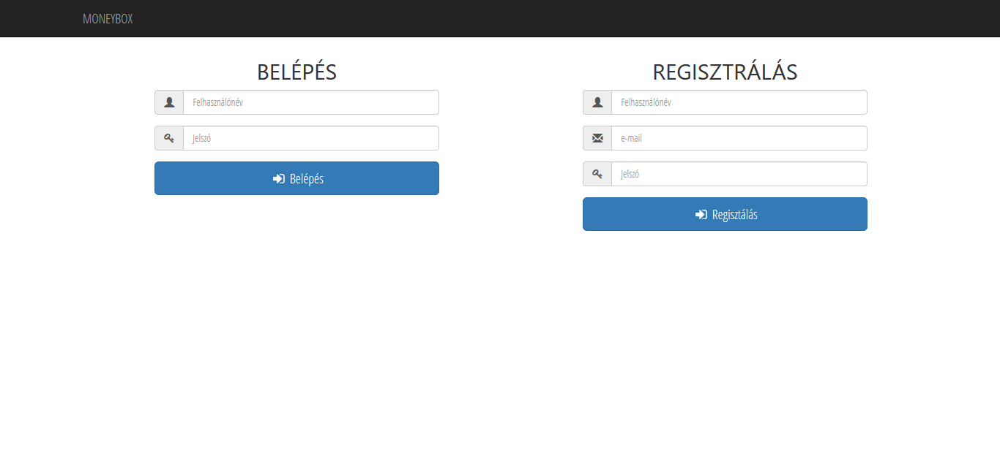
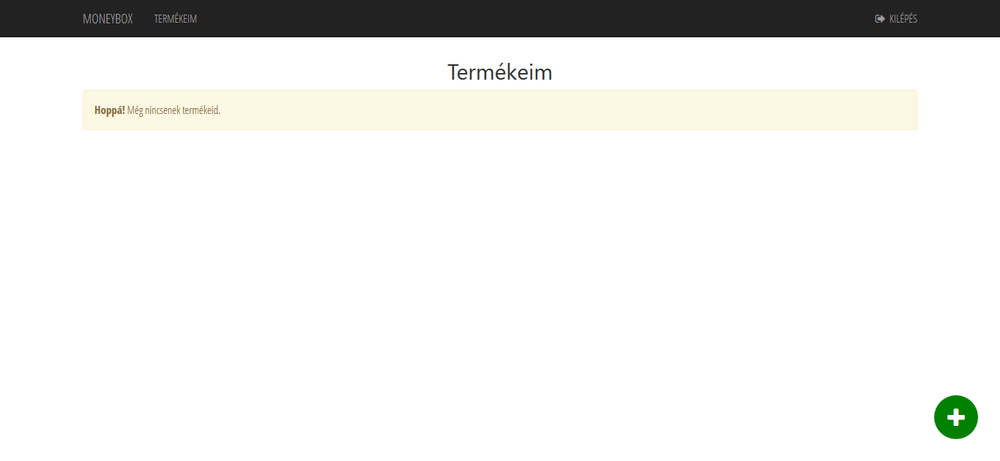
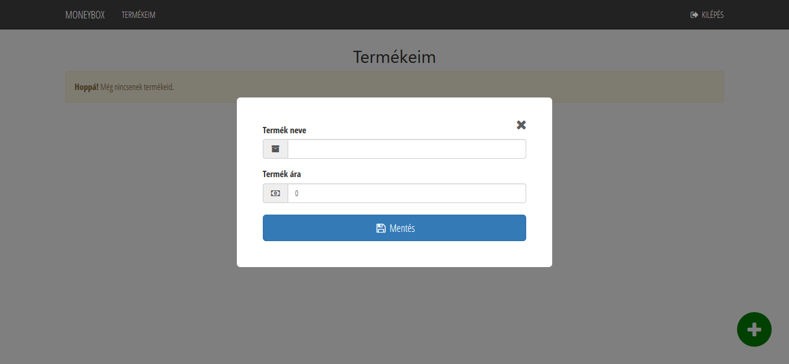
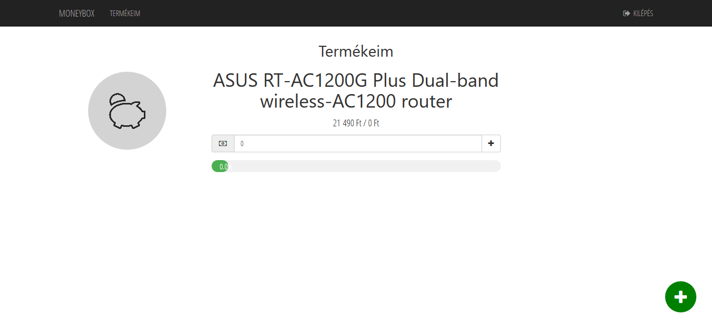
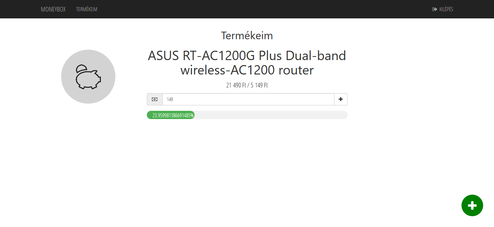

#  moneyBox

## Miért is jó?
- Egy helyen láthatod, hogy eddig mire és mennyi összeget tettél félre.
- stb.

## Használat

1. A következő parancs futtatása:
<code>mvn tomcat7:run</code>
2. Regisztálj a felületen

3. Navigálj a Termékeim menüpontra

4. Használd a jobb alsó sarokban lévő zöld gombot, hogy új terméket vehess fel

5. Ha létezik a termékhez url cím, ahol megvásárolható, add meg azt

6. Add meg a termék nevét és árát, majd mentés

7. A pénz ikon melletti mezőben tudod növelni a félretett összeget. Alatta egy sáv jelzi, hogy hol tartasz a cél felé.

